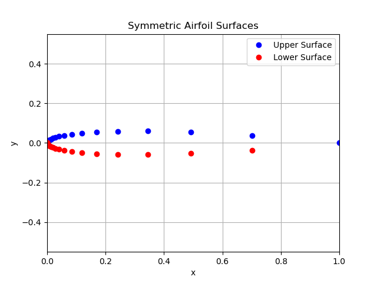
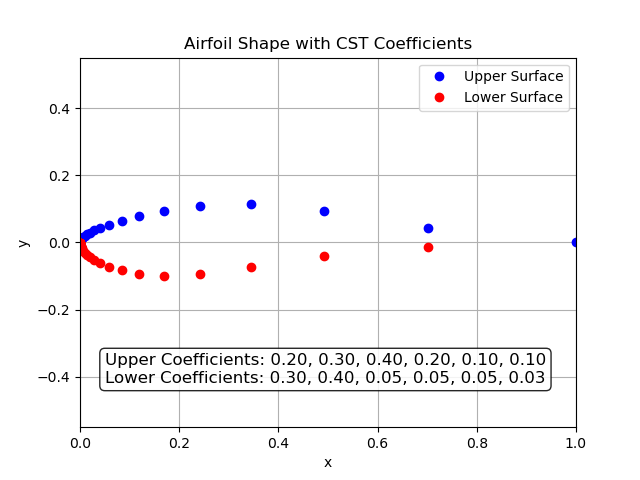
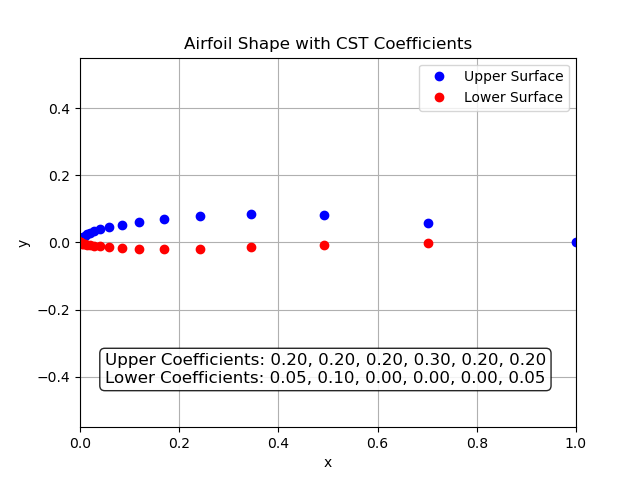

# Multi-Element-Wing-Generator
## Overview
The main motivation for this project is to develop parametric modeling techniques of a multi-element wing structure using a novel combination of:
1. Class Shape Transformations (CST) 
2. Piecewise Cubic Hermite Interpolating Polynomials (PCHIP).

This provides us the following benefits/features.
1. Flexible and efficient fine tuning capabilities allowing for efficient design work flow.
2. Adaptible and versatile enough for coupling with optimization routines.
3. Support for Multiple wings and endplates, with the ability to have certain elements only in certain spanwise ranges
4. Ability to analyse and design around endplate - wing interactions.
5. Scalable Geometry Export in .STEP,.IGES ,and STL file configurations.

## Table of Contents:
[Installation Methods](#installation)
[General Outline of the Problem](#general-outline)
[Shape Transformations](#class-shape-transformation)
[PCHIP Interpolations](#polynomial-hermite-piecewise-interpolation)
[NACA 4 Digit Camber Function](#naca-camber-function)
[Case Folder Structure and explanation](#case-folder-structure-and-explanation)
[Example Usage and Photos](#examples)
[Future plans and Licensing](#future-plans)

## Installation
 - In order to utilize the necessary modules and packages for this code to work we are using python 3.10 managed through a conda environment.
### Copying the Repository to the Current Directory
```bash 
git clone https://github.com/LeanderTenbarge/Multi-Element-Wing-Generator.git
cd Multi-Element-Wing-Generator
```

### Utilizing the .yml file
```bash
conda env create -f environment.yml
```

### Activating the enviroment
```bash
conda activate ocp-env
```
## General Outline
## Class Shape Transformation 
- The CST method allows us to model a fully parameterized airfoil shape \(y(x)\) as the product of a **class function** \(C(x)\) and a **shape function** \(S(x)\).
- The shape coefficients determine the local behavior of the airfoil surface at each control point. In this implementation, we use six upper and six lower shape coefficients, allowing independent control over the thickness distribution of the upper and lower surfaces, respectively.



### Class Function
- Defines the general behaviour (class) of the geometry by evaluating the a class function with multiple parameters controlling leading and trailing edge behavior.
  
$$
C(x) = x^{N_1} (1 - x)^{N_2}
$$

- \(x\) is the normalized chordwise location \([0,1]\)
- \(N_1\) and \(N_2\) are shape parameters controlling leading and trailing edge behavior
  
### Shape Function
- Utilizes a bernstein polynomial expansion, a popular method used in spline based formulations combined with coefficients to modify the shape of the geometry.
- The control points are evenly distributed along the x-axis from 0 to 1. These points represent the locations where each coefficient influences the airfoil's thickness. While using more coefficients provides finer control over the shape, it also increases the complexity of optimization routines. Therefore, six coefficients per surface are typically sufficient.

$$
S(x) = \sum_{i=0}^{n} A_i \, B_{i,n}(x)
$$
$$
B_{i,n}(x) = \binom{n}{i} x^{i} (1 - x)^{n - i}
$$

- $$\ A_i \$$ are the shape coefficients at the control points
- $$\ B_{i,n}(x) \$$ is the Bernstein basis polynomial of degree \(n\)


### Full Expression
Combining these gives the CST Function allowing us to Generate custom Airfoil Profiles. 

$$
y(x) = x^{N_1} (1 - x)^{N_2} \sum_{i=0}^n A_i \binom{n}{i} x^{i} (1 - x)^{n - i}
$$

### Examples
- These are some Feasible examples one might create utilizing this method of manipulating airfoil geometry.



## Polynomial Hermite Piecewise Interpolation
- The ability to control airfoil profiles using CST coefficients enables a wide range of 2D analysis and optimization. However, 2D analysis is inherently limited, as it neglects spanwise behavior, omitting critical information from the aerodynamic performance. In contrast, 3D analysis allows us to optimize the interaction between the wing and the endplate by examining pressure distributions across the wing surface and varying the geometry to maximize lift generation across the entire system.
- The solution to varying the CST coefficients across the span of the wing arises in Polynomial Hermite Piecewise Interpolation or most commonly called PCHIP.
### Why PCHIP?
- **Smooth and Monotonic:**  Unlike other interpolation methods (such as cubic splines), PCHIP preserves monotonicity and avoids overshooting — a critical property for maintaining realistic aerodynamic shapes.

- **Derivative Control:**  PCHIP ensures continuous first derivatives, resulting in smooth and stable transitions between adjacent cross-sections.

- **Spanwise Adaptability:**  By applying PCHIP across the wing span, CST coefficients can vary smoothly, enabling the generation of twisted, tapered, or otherwise customized wing sections.

### How Does It Work?

- To create a curve using PCHIP, we start by defining a set of key points through which the curve must pass. The PCHIP algorithm then constructs a smooth, piecewise interpolation between these points.
- This method is particularly well-suited for aerodynamic applications because it maintains stability and smoothness without introducing oscillations—preserving realistic shape transitions that are critical for performance.

## NACA Camber Function
## Case Folder Structure and Explanation
## Examples 
## Future Plans

