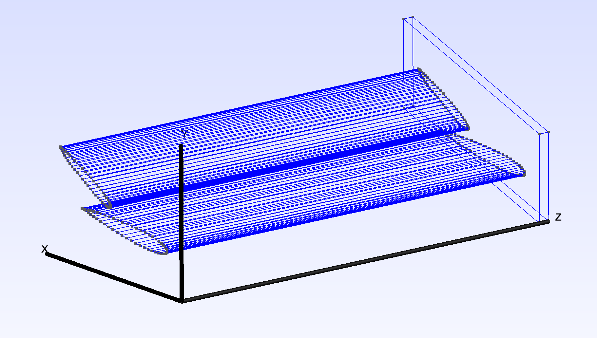
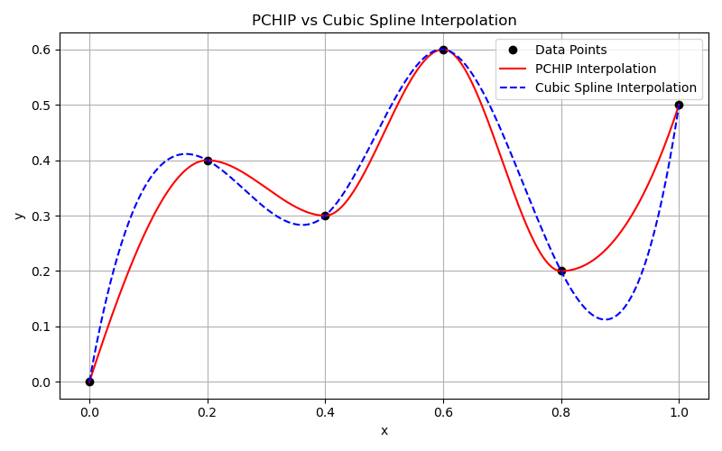

# Multi-Element-Wing-Generator
## Overview
- The main motivation for this project is to develop parametric modeling techniques of a multi-element wing structure with the goal of streamlining design and optimization. This is achieved with a novel combination of the following. 

1. Class Shape Transformations (CST)
   
2. Piecewise Cubic Hermite Interpolating Polynomials (PCHIP).

This provides us the following benefits/features.

1. Flexible and efficient fine tuning capabilities allowing for efficient design work flow.
2. Adaptible and versatile enough for coupling with optimization routines.
3. Support for Multiple wings and endplates, with the ability to have certain elements only in certain spanwise ranges
4. Ability to analyse and design around endplate - wing interactions.
5. Scalable Geometry Export in .STEP,.IGES ,and STL file configurations.

## Table of Contents:
[Installation Methods](#installation)
[Shape Transformations](#class-shape-transformation)
[PCHIP Interpolations](#polynomial-hermite-piecewise-interpolation)
[Case Folder Structure and explanation](#case-folder-structure-and-explanation)
[Example Usage and Photos](#examples)
[Future plans and Licensing](#future-plans)

---

## Installation
 - In order to utilize the necessary modules and packages for this code to work we are using python 3.10 managed through a conda environment.
### Copying the Repository to the Current Directory
```bash 
git clone https://github.com/LeanderTenbarge/Multi-Element-Wing-Generator.git
cd Multi-Element-Wing-Generator
```

### Utilizing the .yml file
```bash
conda env create -f environment.yml
```

### Activating the enviroment
```bash
conda activate ocp-env
```
---

## Class Shape Transformation 
- The CST method allows us to model a fully parameterized airfoil shape \(y(x)\) as the product of a **class function** \(C(x)\) and a **shape function** \(S(x)\).
  
- The shape coefficients determine the local behavior of the airfoil surface at each control point. In this implementation, we use six upper and six lower shape coefficients, allowing independent control over the thickness distribution of the upper and lower surfaces, respectively.
  
- One of the most useful benefits of this method is that it removes the need for an explicit camber function removing multiple optimization parameters without sacrificing functionality.


### Class Function
- Defines the general behaviour (class) of the geometry by evaluating the a class function with multiple parameters controlling leading and trailing edge behavior.
  
$$
C(x) = x^{N_1} (1 - x)^{N_2}
$$

- $$\(x\)$$ is the normalized chordwise location \([0,1]\)
  
- $$\(N_1\) and \(N_2\)$$ are shape parameters controlling leading and trailing edge behavior
  
### Shape Function
- Utilizes a Bernstein polynomial expansion—a widely used approach in spline-based formulations—combined with shape coefficients to define and modify the geometry.
 
- Control points are uniformly distributed along the x-axis from 0 to 1, representing locations where each coefficient influences the airfoil's shape. Increasing the number of coefficients allows for finer control, but also raises the complexity of optimization. In practice, six coefficients per surface (upper and lower) provide a good balance between flexibility and simplicity.

$$
S(x) = \sum_{i=0}^{n} A_i \, B_{i,n}(x)
$$
$$
B_{i,n}(x) = \binom{n}{i} x^{i} (1 - x)^{n - i}
$$

- $$\ A_i \$$ are the shape coefficients at the control points
  
- $$\ B_{i,n}(x) \$$ is the Bernstein basis polynomial of degree \(n\)


### Full Expression
Combining these gives the CST Function allowing us to Generate custom Airfoil Profiles. 

$$
y(x) = x^{N_1} (1 - x)^{N_2} \sum_{i=0}^n A_i \binom{n}{i} x^{i} (1 - x)^{n - i}
$$

### Examples
- These are some Feasible examples one might create utilizing this method of manipulating airfoil geometry.


---

## Polynomial Hermite Piecewise Interpolation
- The ability to control airfoil profiles using CST coefficients enables a wide range of 2D analysis and optimization. However, 2D analysis is inherently limited, as it neglects spanwise behavior, omitting critical information from the aerodynamic performance. In contrast, 3D analysis allows us to optimize the interaction between the wing and the endplate by examining pressure distributions across the wing surface and varying the geometry to maximize lift generation across the entire system.
  
- The solution to varying the CST coefficients across the span of the wing arises in Polynomial Hermite Piecewise Interpolation or most commonly called PCHIP.

- While PCHIP is used to vary CST parameters along the Z-axis (the spanwise direction of the wing), the input files label this variation axis as the Y-axis. This convention should be kept in mind when interpreting or modifying parameter distributions across the span. The Axis system for the multi-element wing is shown below.



  
### Why PCHIP?
- **Smooth and Monotonic:**  Unlike other interpolation methods (such as cubic splines), PCHIP preserves monotonicity and avoids overshooting — a critical property for maintaining realistic aerodynamic shapes.

- **Derivative Control:**  PCHIP ensures continuous first derivatives, resulting in smooth and stable transitions between adjacent cross-sections.

- **Spanwise Adaptability:**  By applying PCHIP across the wing span, CST coefficients can vary smoothly, enabling the generation of twisted, tapered, or otherwise customized wing sections.

### How Does It Work?
- To create a curve using PCHIP, we start by defining a set of key points through which the curve must pass. The PCHIP algorithm then constructs a smooth, piecewise interpolation between these points.
  
- This method is particularly well-suited for aerodynamic applications because it maintains stability and smoothness without introducing oscillations—preserving realistic shape transitions that are critical for performance.

---

## Case Folder Structure and Explanation
- The Case File Structure is composed of 3 main folders, these are the `Wings/`, `Endplates/`, and `Geometry/` folders, all with individual subdirectories as shown below.
```  
 Case Folder/
  ├- Wings/
  |    └── 1/
  |        ├ UpperInput.CSV
  |        ├ LowerInput.CSV
  |        └─Parameters.CSV
  ├- Endplates/
  |     └── 1.CSV        
  └─ Geometry/
         ├ Filename.STEP
         ├ Filename.IGES
         └─Parameters.STL
```
  
### The `Wings/` Folder

- The `Wings/` folder contains subdirectories named numerically (`1/`, `2/`, etc.), each representing a specific wing element (e.g., main element, flap, slat).  
- Inside each subdirectory, there are three `.CSV` files:
  - **`UpperInput.csv`**  
  - **`LowerInput.csv`**  
  - **`Parameters.csv`**

#### File Descriptions

- **`UpperInput.csv` / `LowerInput.csv`**  
  These contain spanwise distributions (via PCHIP interpolation) of the CST shape coefficients for the **upper** and **lower** surfaces, respectively. Each row corresponds to a control point; each column represents a different spanwise location (along the Z-axis, see note below).

- **`Parameters.csv`**  
  This file defines the geometric transformation parameters for the given element across the span:
  - **Angle of Attack** (in radians)  
  - **X Offset** and **Y Offset**  
  - **Slot Gap** and **Overlap**  
  - **Chord Length** (scale factor)
 
### The `Endplates/` Folder 
- The `Endplates/` folder handles the creation of endplates parametrically defined by the leading edge of the first element and the trailing edge of the last element combined with offsets defined by the user to allow for flexibility.
- The Input `.CSV` files are named numerically like the folders in the Wings Directory, and the correspond to a respective endplate.

#### File Descriptions

- **`1.CSV`**
  This file contains the following data, where the leading and trailing edge correspond to 1 and 2 respectively:
  - **Horizontal Offsets**, the distance from the trailing or leading edge to the respective edge of the endplate.
  - **Vertical Offset Upper**, the distance from the trailing or leading edge to the upper surface of the endplate.
  - **Vertical Offset Lower**, the distance from the trailing or leading edge to the lower surface of the endplate.
### The `Geometry/` Folder
- This file contains the results of the script in the following formats.
  1. `.step` 
  2. `.iges` 
  3. `.stl`

## Examples 

## Future Plans

